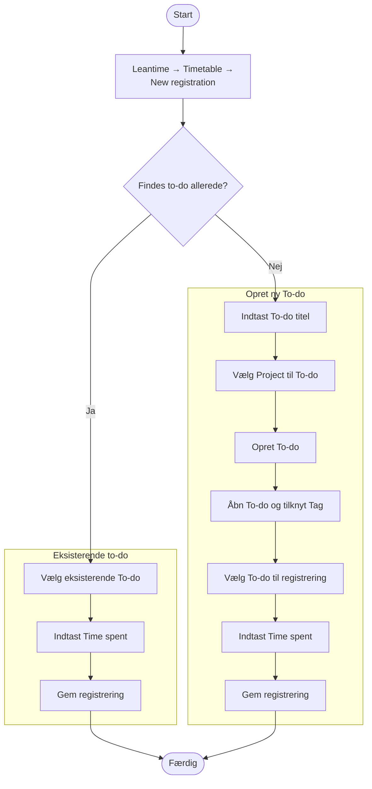

# Struktur for tidsregistrering

## Formål

Formålet med tidsregistrering i OS2-sekretariatet er at skabe **gennemsigtighed, læring og overblik** over, hvordan vores tid anvendes på tværs af produkter, fællesskab og drift. Systemet skal være enkelt at bruge, let at forstå og give meningsfuld rapportering.

## 1. Grundidé

Registrering sker i **[Leantime](https://itk-leantime.itkdev.dk/)** og bygger på princippet:

> **En registrering = ét projekt (hvor) + én opgave (hvad) + ét tag (type) + tid (hvor længe).**

Systemet er designet til at:
- være **let at registrere i** (få valg og så vidt muligt foruddefinerede felter)
- **være forståeligt** (ensartede betegnelser)
- **understøtte rapportering** (på produkt, kategori og arbejdstype)

## 2. Grundprincipper

- **Projekt = hvor** du arbejder (OS2-projekt, OS2-produkt eller sekretariatsprojekt, -ydelsesområde).  
- **Opgave (to-do) = hvad** du laver (kort titel på opgaven, [se eksempler](processes/task_examples)).  
- **Tag = type** kategori for det du laver (rådgivning, koordinering, drift, kommunikation osv.).  
- **Tid = hvor længe** du har brugt (i kvarte timer).  

## 3. Projekter i OS2-sekretariatet

For at holde systemet overskueligt arbejder vi med et udgangspunkt af en fast og begrænset liste af projekter (hvor).  
Listen omfatter både OS2-produkter, OS2-projekter, interne projekter og sekretariatets tværgående ydelsesområder.

### A. OS2-produkter og -projekter
Kun produkter, hvor sekretariatet har en aktiv rolle er oprettet som standard f.eks.:
- OS2valghalla  
- OS2iot  
- OS2ai  
- OS2opendata  
- OS2skole  

### B. Tværgående sekretariatsområder

| Projekt | Bruges til |
|--------|--------|
| **Produkter & projekter** | Generel støtte og rådgivning til OS2-produkter, hvor arbejdet ikke entydigt hører under ét specifikt produkt. |
| **Governance & bestyrelsesbetjening** | Udarbejdelse af beslutningsoplæg, referater, strategisk sparring og opfølgning. |
| **Kommunikation & formidling** | Nyhedsbreve, hjemmeside, SoMe, oplæg, presse og events. |
| **Medlemsservice & fællesskab** | Kontakt til medlemmer, onboarding, medlemsopfølgning, netværk og samarbejde. |
| **Strategi & interessevaretagelse** | Samarbejde med KL, KOMBIT, EU, OSPO’er og fællesoffentlige initiativer. |
| **Kompetenceudvikling & videndeling** | Kurser, konferencer, oplæg og intern læring. |
| **Administration & drift** | Økonomi, fakturaer, kontrakter, kontoplan, personale og daglige driftsopgaver. |

### C. Ad-hoc og årlige aktiviteter

| Projekt | Bruges til |
|----------|------------|
| **Årsmøde og generalforsamling** | Planlægning, forberedelse og afholdelse af OS2’s årsmøde og generalforsamling. |
| **Community event** | Planlægning og gennemførelse af fællesskabsdage, leverandørmøder og samarbejdsevents. |
| **Messedeltagelse** | Koordinering og gennemførelse af OS2s deltagelse på messer og konference som stadeholder. |

### D. Internt område

| Projekt | Bruges til |
|----------|------------|
| **Intern tid** | Ferie, fravær, sygdom, pauser, frokost, intern sparring og møder uden opgaver. |

## 4. Tags (kategorier for opgavetype)

De faste **tags** bruges til at klassificere opgaven (to-do) på tværs af projekter.  
De gør det muligt at følge fordelingen af tid på tværs af funktioner.  

| Tag | Formål / eksempel |
|-----|--------------------|
| **Rådgivning** | Sparring, analyse og vejledning til medlemmer, produkter og projekter. |
| **Koordinering** | Planlægning, facilitering, møder, styregrupper og opfølgning. |
| **Udvikling & drift** | Udarbejdelse af værktøjer, test, dokumentation, releaseplanlægning. |
| **Kommunikation** | Nyhedsbreve, artikler, oplæg, SoMe, presse og materialer. |
| **Governance** | Sagsfremstillinger, beslutningsoplæg, rapporter og udvikling af styringsmodel. |
| **Administration** | Fakturaer, kontrakter, medlemsregistrering og økonomistyring. |
| **Strategi & interessevaretagelse** | Samarbejde med KL, KOMBIT, OSPO’er, EU og fællesoffentlige projekter. |
| **Kompetenceudvikling** | Kurser, konferencer, videndeling og intern læring. |

## 5. Registrering i Leantime

> Brug korte, sigende opgavetitler – f.eks. *“Udarbejde governance-rapport”* eller *“Forberede OS2-seminar”*.  
>  
> Hvis en opgave dækker flere projekter, registrer på et tværgående ydelsesområde eller del tiden op i flere registreringer.

## 6. Eksempler på registreringer

Der er nogle [eksempler på registreringer her](task_examples).

## 7. Regler og gode vaner
- En registrering = ét projekt + én opgave + ét tag + tid.  
- Brug konsekvente navne for projekter (fx “OS2 valghalla” med mellemrum så det er søgbart).  
- Del tiden op, hvis en opgave dækker flere projekter.  
- Intern tid registreres altid særskilt.  
- Brug samme kategorisering på tværs af projekter og opgaver for at sikre sammenlignelig rapportering.
