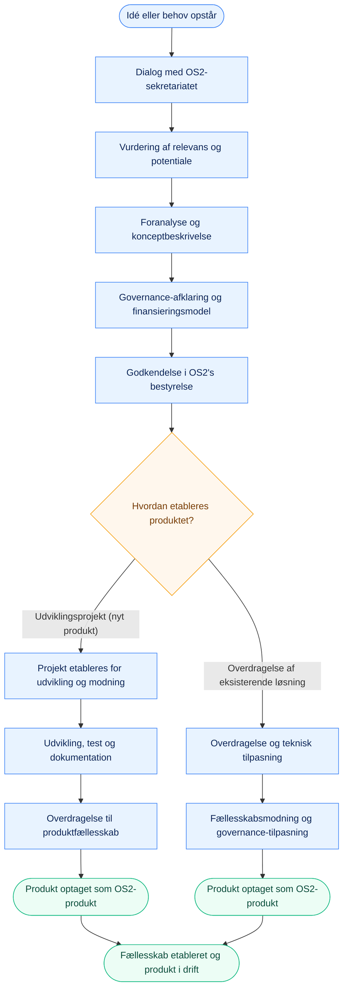

# Projekter, Produkter og fællesskaber
I afsnittet får du overblik over OS2’s produktportefølje og får beskrevet, hvordan sekretariatet understøtter fællesskaberne omkring hvert projekt og produkt.  
Afsnittet hjælper nye medarbejdere, produktkoordinatorer og samarbejdspartnere med at forstå, hvordan OS2’s projekter og produkter organiseres, driftes og videreudvikles i et fællesskab.

## OS2’s produktportefølje {#portfolio}
OS2 består af en række fællesoffentlige open source-produkter, som udvikles, driftes og videreudvikles i samarbejde mellem offentlige myndigheder og private leverandører.  
Hvert produkt har sit eget fællesskab med deltagende myndigheder, leverandører og andre aktører. Hvert produkt placeres i OS2’s produktniveauer efter modenhed og governance-praksis.

Den samlede oversigt over OS2-produkter findes på:  
- [produkter.os2.eu](https://produkter.os2.eu)

Hvert produkt har (når fuldt etableret):
- en **styregruppe** med beslutningskompetence.  
- en **produktkoordinator** til at varetage den daglige koordinering.  
- en **koordinationsgruppe** til at støtte produktkoordinator med opgaveløsning, sparring og faglige input.  
- en **fælles ramme for styring** ([OS2s styringsmodel](https://governance.os2.eu)), der sikrer placering i OS2s produktnivauer samt åbenhed og kvalitet i udviklingen.

## Forskellen på projekt, produkt og fællesskab {#forskel}
For at arbejde effektivt i OS2 er det vigtigt at kende forskellen på de tre grundbegreber:

| Begreb | Definition | Formål |
|---------|-------------|--------|
| **Projekt** | En tidsbegrænset indsats med klart afgrænset mål og leverance. | At udvikle eller forbedre en løsning. Projekter kan føre til nye produkter. |
| **Produkt** | En færdig eller driftsmoden løsning, som vedligeholdes og videreudvikles i fællesskab. | At levere stabil funktionalitet, dokumentation og support til brugerne. |
| **Fællesskab** | Den gruppe af organisationer, personer og leverandører, der sammen ejer, bruger og udvikler et produkt. | At sikre engagement, ejerskab og fælles retning. |

💡 Et projekt skaber noget nyt.  
🔧 Et produkt holder det i live.  
🤝 Et fællesskab gør det stærkere.  

## Hvordan sekretariatet understøtter {#support}
Sekretariatets rolle er at sikre, at hvert projekt og produkt drives åbent, koordineret og med fokus på kvalitet, men uden selv at være den udførende part på sigt.
Sekretariatet bidrager til at få processer i gang, skabe struktur og sikre sammenhæng, så fællesskaberne kan overtage og videreføre arbejdet.  

Det gør vi ved at tilbyde support, struktur og sparring i alle faser af projektets og produktets livscyklus.

**Sekretariatets hovedopgaver i understøttelse:**
- **Koordinering:** Agerer bindeled mellem aktører og sikrer fremdrift i samarbejdet.  
- **Governance:** Bidrager til, at produktet følger OS2’s governance-model og anvender fælles skabeloner.  
- **Kvalitet:** Understøtter udarbejdelse og vedligeholdelse af dokumentation, licenser, sikkerhed og compliance.  
- **Facilitering:** Hjælper fællesskaber med at skabe engagement, afholde møder og formidle resultater.  
- **Synlighed:** Bidrager til kommunikation, nyheder og opdateringer på os2.eu og sociale medier.  
- **Sparring:** Rådgiver om strategi, økonomi og produktudvikling.  

💡 Sekretariatet arbejder på vegne af OS2’s bestyrelse for at sikre, at hvert projekt og produkt drives åbent, koordineret og med fokus på kvalitet, men uden selv at være den udførende part på sigt.

## Processen for nye produkter {#process}
Når nye idéer opstår, hjælper sekretariatet med at modne dem og vurdere, om de egner sig som OS2-produkter.

**Fra idé til projekt til OS2-produkt:**
Nye løsninger i OS2 starter som en idé eller et konkret behov hos en offentlig myndighed.
Sekretariatet hjælper med at modne idéen, afklare governance og vurdere, om den egner sig som OS2-produkt.  
Afhængigt af udgangspunktet kan processen føre til et nyt udviklingsprojekt, hvor produktet skabes fra bunden, eller til en overdragelse af en eksisterende løsning, som tilpasses til brug i et fællesskab.

Flowchartet nedenfor viser i forenklet form de typiske trin fra idé til OS2-produkt.

> Processen kan variere afhængigt af løsningens kompleksitet og parternes modenhed, men alle OS2-produkter skal igennem en governance-afklaring før optagelse.

### Fra OS2-projekt til OS2-produkt
OS2 skelner mellem to niveauer af fælles udvikling:  
**projekter**, hvor idéer og løsninger afprøves og modnes (sandkassefasen),  
og **produkter**, som er optaget formelt i OS2’s portefølje og drives i et etableret fællesskab.  
De to niveauer har forskellige krav og forventninger til governance, ejerskab og finansiering.

### Kriterier for OS2-projekt (sandkassefase)
Et OS2-projekt er en idé eller løsning, som afprøves og modnes med henblik på eventuel optagelse som OS2-produkt.  
Formålet er at teste potentialet, skabe fælles erfaringer og afklare governance, finansiering og ejerskab.

**Kriterier:**
- Løsningen skal være **open source eller på vej til at blive det** (licensafklaring i gang).  
- Der skal være **mindst én offentlig myndighed** som ejer eller driver projektet.  
- Der skal foreligge en **foreløbig plan** for governance, økonomi og forankring.  
- Der skal være et **identificeret behov på tværs af myndigheder** – potentiale for fælles anvendelse.  
- Sekretariatet kan tilbyde **rådgivning, koordinering og struktur**, men projektet drives lokalt.  

*Formålet med sandkassefasen er at give plads til at eksperimentere og lære, før der etableres et fuldt fællesskab.*

### Kriterier for OS2-produkt (optagelsesfase)
Et OS2-produkt er en løsning, som har opnået en fælles governance-struktur, og som forvaltes i et åbent fællesskab mellem flere offentlige aktører.  
Produktet skal have dokumenteret kvalitet, åbenhed og bæredygtighed i drift og udvikling.

**Kriterier:**
- Løsningen skal bygge på **open source** med **OSI-godkendt licens** (som standard MPL 2.0).  
- Der skal være **offentligt ejerskab** og **minimum to deltagende offentlige myndigheder**.  
- Der skal være etableret **struktur for governance**.  
- Der skal være **langtidsholdbar finansiering** og aktivt engagement i fællesskabet.  
- Dokumentation, roadmap og aftaler skal være **offentligt tilgængelige** (GitHub / Nextcloud).  

*Formålet med produktfasen er at sikre stabilitet, kvalitet og fælles ejerskab — det, der gør løsningen til et egentligt OS2-produkt.*

Sekretariatet bistår med vurdering, dokumentation og kontakt til bestyrelsen.

## Skabeloner og vejledninger {#templates}
OS2 anvender en række fælles skabeloner for at sikre kvalitet og ensartethed i produktarbejdet.  
Alle skabeloner findes i GitHub og Nextcloud. Listen er ikke udtømmende, [bidrag](./docs/CONTRIBUTE.md) gerne med manglende skabeloner eller forbedringer.

| Dokument / skabelon | Formål | Placering |
|----------------------|---------|-----------|
| **Governance-checklisten** | Hjælper til at sikrer at produktet opfylder OS2’s kvalitets- og dokumentationskrav. | GitHub: [governance_template.md](https://github.com/OS2offdig/governance_report_template) |
| **Tilslutningsaftale** | Regulerer deltagelse og økonomiske bidrag fra medlemmer i et produkt. | [Nextcloud / Skabeloner](https://boks.os2.eu/s/Di5cTQdSABd6ak4?path=%2FSkabeloner) |
| **FLOSS-aftale** | Juridisk ramme for open source-samarbejder. | [Nextcloud / Skabeloner](https://boks.os2.eu/s/Di5cTQdSABd6ak4?path=%2FSkabeloner) |
| **Kommunikationsskabeloner** | Giver ensartet formidling på tværs af produkter. | [Nextcloud / Skabeloner](https://boks.os2.eu/s/Di5cTQdSABd6ak4?path=%2FSkabeloner) |
| **Produkt- og projektskabeloner** | Understøtter dokumentation og styring. | [GitHub](https://github.com/OS2offdig) |

## Sammenfatning
OS2’s produkter er fælleseje mellem offentlige myndigheder og udvikles i åbne fællesskaber.  
Sekretariatets rolle er at understøtte, at produkterne drives professionelt, dokumenteres åbent og styres efter fælles standarder.  
Når vi arbejder efter samme governance, skabeloner og principper, skaber vi fælles kvalitet, åbenhed og bæredygtighed – i bedste fællesskabsånd.
